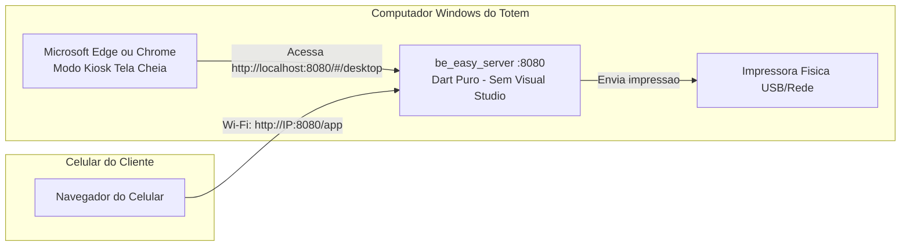

# Guia do Totem em Modo Web (Quiosque Windows) — Sem Visual Studio 🚀

Se você não quer ou não consegue instalar o Visual Studio (que ocupa mais de 15 GB de disco), você pode operar o **be EASY Print** no Windows utilizando a arquitetura **Web Kiosk**.

Esta é exatamente a mesma tecnologia utilizada em totens de autoatendimento profissionais em redes de fast food e aeroportos.

---

## 💡 Como Funciona



1. **O Servidor Local (`be_easy_server`)**:
   - É executado no Windows em segundo plano.
   - **NÃO precisa do Visual Studio** (é código Dart puro).
   - Gerencia a fila de impressão, banco SQLite e gera cobranças PIX.
   - Hospeda a aplicação web diretamente na porta `8080`.
2. **A Tela do Totem (Frontend)**:
   - Abre no **Microsoft Edge** (já pré-instalado no Windows 10/11) ou Google Chrome em **Modo Quiosque (Tela Cheia)**.
   - Não exibe barra de endereço, botões do navegador nem abas. Fica visualmente idêntico a um aplicativo nativo!
3. **Os Clientes no Celular**:
   - Conectam no Wi-Fi e escaneiam o QR Code na tela para enviar arquivos normalmente.

---

## 🚀 Como Iniciar em 1 Clique

Criamos scripts prontos na pasta `scripts/`:

### Passo 1: Iniciar o Totem
Basta dar dois cliques no arquivo:
```cmd
scripts\iniciar_totem_web.bat
```
Ele irá:
1. Iniciar o servidor local Shelf na porta `8080` (em janela minimizada).
2. Abrir o Microsoft Edge em tela cheia na URL do totem (`http://localhost:8080/#/desktop`).

### Passo 2 (Opcional): Gerar um executável autônomo do servidor (`server.exe`)
Se quiser compilar o servidor em um arquivo executável `.exe` de apenas 15 MB **sem precisar do Visual Studio**:
1. Dê dois cliques em:
   ```cmd
   scripts\compilar_servidor_windows.bat
   ```
2. O Dart compilará nativamente o arquivo `be_easy_server\server.exe` em menos de 5 segundos!

---

## ⚡ Como Fazer o Totem Abrir Sozinho ao Ligar o Windows

1. Pressione as teclas <kbd>Windows</kbd> + <kbd>R</kbd>.
2. Digite:
   ```text
   shell:startup
   ```
   e aperte **Enter**. A pasta de Inicialização do Windows será aberta.
3. Clique com o botão direito no arquivo `scripts\iniciar_totem_web.bat` e escolha **Criar Atalho**.
4. Mova esse atalho criado para dentro da pasta que você abriu (`shell:startup`).

Pronto! Sempre que o computador ligar, o servidor e a tela do totem em tela cheia abrirão sozinhos!
